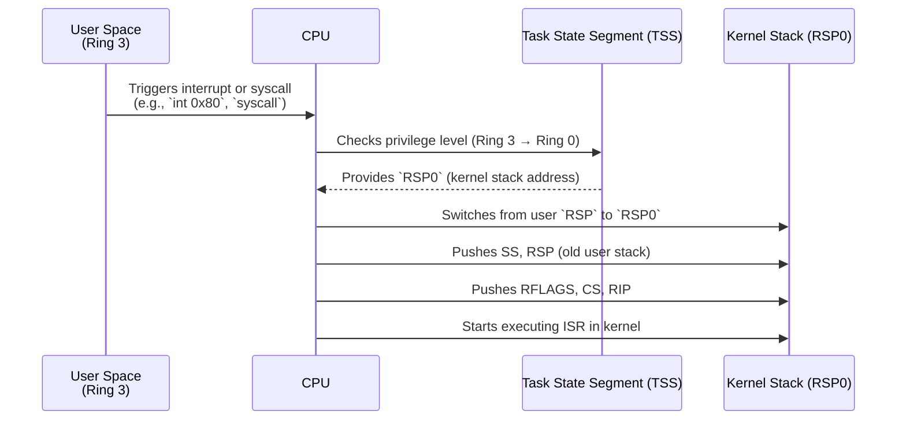
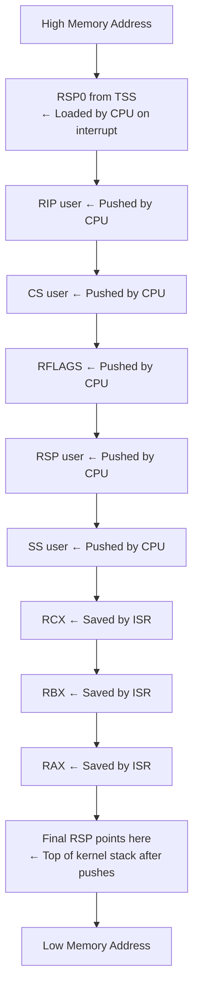
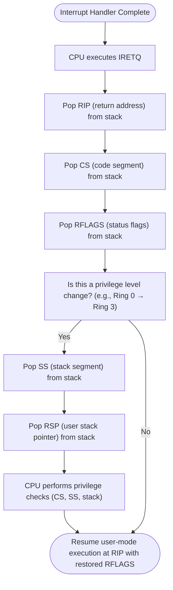

# Lecture 2: Review of I/O Hardware
See https://claude.ai/public/artifacts/f0cbf51a-0486-4f15-b4c6-3e57b3c4dd65

## Overview
This lecture covers the fundamental concepts of I/O hardware organization and interrupt handling mechanisms in operating systems.

## Key Topics

### I/O Device Architecture
- I/O devices connect to computers through **device controllers** attached to the system bus
- Device controllers contain control registers and buffers accessible by the CPU
- CPU initiates I/O by writing to controller registers and buffers

### Device Access Methods
- **Memory-mapped I/O**: Device registers appear as memory addresses
- **I/O-mapped I/O**: Separate address space for I/O operations
- Both methods can be used simultaneously for the same device

### I/O Completion Detection
Since I/O operations are asynchronous, the CPU uses two methods to detect completion:
- **Polling**: CPU repeatedly checks device status
- **Interrupts**: Device signals completion to CPU (preferred method)

### Interrupt Handling System
- **Interrupt lines**: Shared communication channel between devices and CPU
- **Daisy chaining**: Multiple devices sharing single interrupt line
- **Vectored interrupts**: Dedicated interrupt controller for efficient source identification
- **Interrupt priorities**: Higher priority interrupts can preempt lower priority ones

### Interrupt Processing Flow
1. CPU automatically saves critical registers (program counter, status word)
2. Jump to interrupt service routine based on interrupt vector
3. Service routine saves additional registers it will modify
4. Perform necessary I/O operations and device management
5. Restore all saved registers
6. Return to original program execution using special instruction (IRET)

User to kernel stack switch


```markdown
High Memory Address (RSP0 from TSS) ← Stack pointer before CPU pushes
---------------------------------------------------------
| RIP       | ← Pushed first by CPU
| CS        |
| RFLAGS    |
| RSP       | ← Only on CPL change (user → kernel)
| SS        | ← Only on CPL change
| RCX       | ← Pushed by ISR
| RBX       |
| RAX       |
---------------------------------------------------------
Low Memory Address (Current RSP after ISR saves registers) = Top of Stack
```



The following Mermaid diagram visualizes what happens when `IRETQ` is executed:


Comparison between RET and IRET:
```markdown
| Feature                | `RET`                  | `IRET`                                          |
| ---------------------- | ---------------------- | ----------------------------------------------- |
| Used for               | Normal function return | Interrupt/exception return                      |
| Pops                   | Just `RIP`/`EIP`       | `RIP`, `CS`, `RFLAGS`, (optionally `SS`, `RSP`) |
| Handles Ring Changes   | ❌ No                   | ✅ Yes                                           |
| Re-enables interrupts? | ❌ No                   | ✅ If IF flag was set                            |
```

### Important Concepts
- **Interrupt transparency**: Interrupt handling must be invisible to running programs
- **Interrupt masking**: Lower priority interrupts can be temporarily disabled
- **Traps**: Software-generated interrupts used for system calls
- **Synchronous vs Asynchronous**: Exceptions and traps are synchronous with program execution, unlike hardware interrupts

### Best Practices
- Interrupts should not be disabled for extended periods to avoid losing signals
- Proper state saving and restoration ensures program transparency
- Interrupt controllers improve efficiency in multi-device systems
