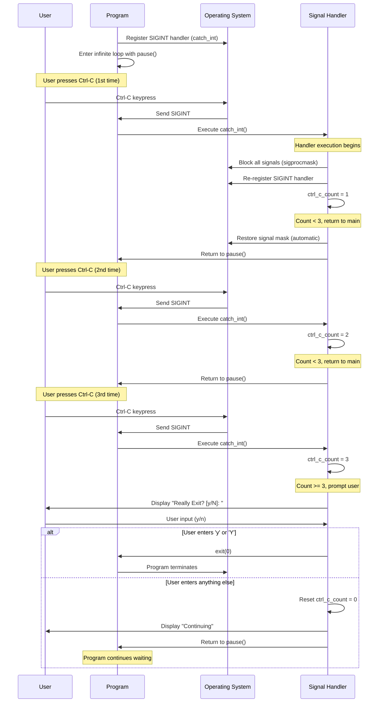

# Signals in Unix Operating Systems

## Overview

This document covers the fundamental concepts of signals in Unix-like operating systems, based on Lecture 11 from Operating Systems (CS330) course at IIT Kanpur.

**Lecturer:** Deepak Gupta  
**Notes by:** Pankaj Maurya  
**Date:** August 23, 2004

## Table of Contents

- [What are Signals?](#what-are-signals)
- [Signal Sources and Uses](#signal-sources-and-uses)
- [Common Unix Signals](#common-unix-signals)
- [Sending Signals](#sending-signals)
- [Kernel Implementation](#kernel-implementation)
- [Signal Masking](#signal-masking)
- [System Call Effects](#system-call-effects)
- [Key Takeaways](#key-takeaways)

## What are Signals?

Signals are an **inter-process synchronization mechanism** with the following characteristics:

- Cannot communicate data, only signal the occurrence of events
- Interrupt whatever the process was doing when received
- Force immediate handling by the receiving process
- Software analog of hardware exceptions and interrupts
- Can be synchronous or asynchronous from the process perspective

## Signal Sources and Uses

Signals are generated by four main categories of events:

### 1. Exception-Related Events
Hardware-level exceptions that result in OS signal delivery:
- Floating point errors
- Illegal address access
- Illegal instruction execution

### 2. Software Conditions
Unusual program conditions requiring attention:
- Writing to a pipe with no readers
- Alarm timeouts
- Other program-specific conditions

### 3. Inter-Process Coordination
Communication between processes:
- Process completion notifications
- Parent-child process communication
- Event synchronization between processes

### 4. User Interactions
Keyboard combinations interpreted as signal requests:

| Key Combination | Signal | Default Action | Description |
|----------------|--------|----------------|-------------|
| `Ctrl-C` | SIGINT | Terminate | Interrupt signal |
| `Ctrl-Z` | SIGSTOP | Stop | Suspend process |
| `Ctrl-\` | SIGABRT | Core dump | Abort with dump |

## Common Unix Signals

| Signal | Default Action | Description |
|--------|----------------|-------------|
| SIGINT | Terminate | Interrupt (Ctrl-C) |
| SIGSTOP | Stop | Stop process |
| SIGILL | Core dump | Illegal instruction |
| SIGSEGV | Core dump | Illegal address access |
| SIGFPE | Core dump | Floating point error |
| SIGCONT | Continue | Continue if stopped |
| SIGUSR1 | Terminate | User-defined signal 1 |
| SIGUSR2 | Terminate | User-defined signal 2 |
| SIGKILL | Terminate | Termination (cannot be caught/blocked) |
| SIGCHLD | Ignore | Child process terminated/stopped |

> **Note:** See complete list with `man 7 signal`

## Sending Signals

Use the `kill` system call to send signals between processes:

```c
int kill(pid_t pid, int sig);
```

> **Reference:** `man 2 kill`

## Kernel Implementation

The kernel maintains three key data structures for each process:

### 1. Signal Disposition
The action a process takes when receiving a signal:
- **Default:** System-defined default action
- **Ignore:** Receipt of signal is ignored
- **Handle:** Execute custom handler function

**Exceptions:** SIGKILL and SIGSTOP cannot be caught, ignored, or blocked.

### 2. Signal Delivery
- Kernel maintains a **pending signals bit vector**
- Signal delivery sets the appropriate bit
- If multiple instances of same signal arrive before handling, only one is processed
- Sleeping processes are woken up when signals arrive

### 3. Signal Handling
- Actual handling occurs when process transitions from kernel to user mode
- Process checks for pending signals before returning to user mode
- Custom handlers require special kernel mechanisms to preserve execution context

#### Signal Handler Execution Flow

The following diagram illustrates the complex process of executing a custom signal handler:


**Key Points:**
- The kernel manipulates the user stack to insert special `sigreturn` code
- This ensures the process returns to kernel mode after handler execution
- Allows proper signal mask management (blocking/unblocking)
- The entire mechanism is transparent to the user program
- The process resumes execution at the exact point where it was interrupted

### Changing Signal Disposition

```c
void sigaction(int signo, const struct sigaction *action,
               struct sigaction *old_action);
```

> **Reference:** `man 2 sigaction`

## Signal Masking

### Purpose
Prevent race conditions by temporarily blocking signals during critical code sections.

### Implementation
Use `sigprocmask()` to modify or examine blocked signals:

```c
int sigprocmask(int how, const sigset_t *set, sigset_t *oset);
```

### Parameters
- `how`: Operation type
  - `SIG_BLOCK`: Add signals to current mask
  - `SIG_UNBLOCK`: Remove signals from current mask
  - `SIG_SETMASK`: Replace current mask entirely
- `set`: Signal set to operate on
- `oset`: Previous mask (for restoration)

### Signal Set Operations

```c
sigset_t mask_set;

/* Initialize empty set */
sigemptyset(&mask_set);

/* Add specific signal */
sigaddset(&mask_set, SIGINT);

/* Check if signal is in set */
if (sigismember(&mask_set, SIGINT))
    printf("SIGINT is in our set\n");

/* Add all signals */
sigfillset(&mask_set);
```

## System Call Effects

### fork()
- **Signal actions:** Inherited from parent
- **Blocked signals:** Inherited from parent
- **Pending signals:** Cleared (not inherited)

### execve()
- **Default/Ignored dispositions:** Remain unchanged
- **Custom handlers:** Reset to default (SIG_DFL)
- **Blocked signals:** Remain blocked (unaffected)

## Signal Handling Example

### Program Overview

The following C program demonstrates practical signal handling by implementing a "three strikes" Ctrl-C handler:

**Key Features:**
- Catches SIGINT (Ctrl-C) signals using a custom handler
- Requires 3 consecutive Ctrl-C presses before prompting for exit confirmation
- Uses signal masking to prevent race conditions during handler execution
- Demonstrates proper signal handler registration and re-registration

**Code Summary:**
```c
// Global counter for Ctrl-C presses
int ctrl_c_count = 0;
#define CTRL_C_THRESHOLD 3

void catch_int(int sig_num) {
    // Block all signals during handler execution
    sigfillset(&mask_set);
    sigprocmask(SIG_SETMASK, &mask_set, &old_set);
    
    // Re-register handler for next signal
    signal(SIGINT, catch_int);
    
    // Increment counter and check threshold
    if (++ctrl_c_count >= CTRL_C_THRESHOLD) {
        // Prompt user for exit confirmation
        // Reset counter if user chooses to continue
    }
    // Signal mask automatically restored on return
}
```

### Program Execution Flow



### Key Implementation Details

1. **Signal Masking**: The handler blocks all signals during execution to prevent race conditions
2. **Handler Re-registration**: Each handler execution re-registers itself for the next signal
3. **Threshold Logic**: Only prompts for exit after 3 consecutive Ctrl-C presses
4. **Automatic Cleanup**: Signal masks are automatically restored when handler returns
5. **Infinite Loop**: Main program uses `pause()` to wait efficiently for signals

### Learning Points

- **Race Condition Prevention**: Demonstrates proper use of `sigprocmask()` to block signals during critical sections
- **Handler Persistence**: Shows how to maintain signal handlers across multiple invocations
- **User Interaction**: Illustrates safe user input handling within signal handlers
- **State Management**: Maintains counter state across signal handler invocations
- **Graceful Exit**: Provides user control over program termination

## Key Takeaways

1. **Asynchronous Nature:** Signals handle unexpected, seemingly random events
2. **Multiple Sources:** Hardware events, software conditions, process interactions, user input
3. **Race Conditions:** Careless signal handling can cause subtle, intermittent bugs
4. **Reliability:** Modern Unix provides mechanisms for reliable signal handling
5. **Critical Sections:** Use signal masking to protect sensitive code regions

## Best Practices

- Always handle signals properly to avoid race conditions
- Use signal masking for critical code sections
- Understand the difference between signal delivery and handling
- Be aware of signal inheritance behavior in fork/exec operations
- Test signal handling thoroughly as bugs may be intermittent

## References

- `man 7 signal` - Complete signal list
- `man 2 kill` - Signal sending
- `man 2 sigaction` - Signal disposition management
- `man 2 sigprocmask` - Signal masking

---

*This document is based on CS330 Operating Systems lecture materials from IIT Kanpur.*
